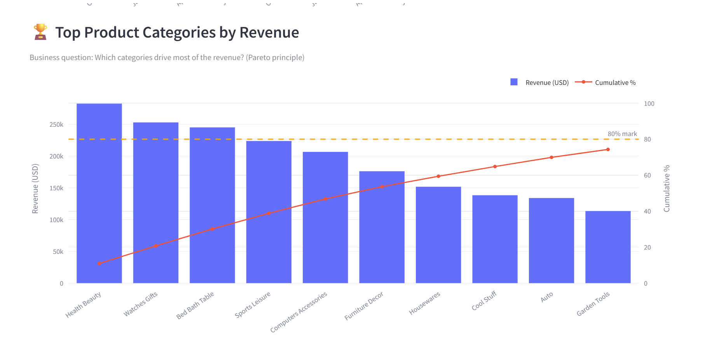

<div align="center">

# 🛒 Retail Sales Insight Dashboard

> End-to-end data analytics pipeline — from raw CSV ingestion to an interactive business insights dashboard.
> Built with Python, SQLite, pandas, Streamlit, and Plotly. Runs fully locally with a single command.



</div>

---

## Overview

This project answers a core business question for an e-commerce company:

> **"Where is revenue coming from, how is it trending, and what is hurting customer satisfaction?"**

Using the [Brazilian E-Commerce Public Dataset by Olist (Kaggle)](https://www.kaggle.com/datasets/olistbr/brazilian-ecommerce), the pipeline ingests raw order data from multiple CSV sources, loads it into a local SQLite database, cleans and enriches it with pandas, and surfaces the insights as an interactive Streamlit dashboard.

---

## Pipeline Architecture

```
┌─────────────────┐    ┌──────────────┐    ┌──────────────────────┐
│   1. EXTRACT     │ →  │ 2. TRANSFORM │ →  │    3. VISUALIZE      │
│                 │    │              │    │                      │
│  CSV files      │    │  transform   │    │  dashboard.py        │
│  (8 Kaggle CSVs)│    │  .py         │    │  Streamlit + Plotly  │
│                 │    │              │    │                      │
│  Web scrape     │    │  queries.py  │    │  KPI cards           │
│  (FX rate)      │    │  SQL layer   │    │  Revenue trend       │
│                 │    │              │    │  Top categories      │
│  ingest.py      │    │  SQLite DB   │    │  Delivery perf.      │
│  pandas + sqlite│    │  analytics_  │    │  Review scores       │
│                 │    │  master      │    │                      │
└─────────────────┘    └──────────────┘    └──────────────────────┘
```

---

## Tech Stack

| Tool | Role | Why chosen |
|---|---|---|
| **pandas** | Read CSVs, clean data, merge tables | Industry-standard for tabular data; readable for beginners |
| **SQLite3** | Persist data, run SQL aggregations | Zero-setup database; file-based so the repo stays portable |
| **BeautifulSoup** | Scrape live BRL/USD exchange rate | Demonstrates pulling data from a non-CSV source |
| **Streamlit** | Dashboard web app framework | Build interactive UIs with pure Python — no JS needed |
| **Plotly** | Interactive charts | Hover tooltips, zoom, and filters out of the box |
| **python-dotenv** | Load credentials from `.env` | Professional secret management; keeps API keys out of code |

---

## Project Structure

```
retail-sales-intelligence/
│
├── data/
│   ├── raw/                  ← place Kaggle CSVs here (gitignored)
│   └── processed/            ← cleaned output (gitignored)
│
├── db/
│   └── ecommerce.db          ← auto-created SQLite database (gitignored)
│
├── src/
│   ├── ingest.py             ← Step 1: read CSVs → load into SQLite
│   ├── transform.py          ← Step 2: clean, engineer features, build master table
│   ├── queries.py            ← SQL queries → return DataFrames for dashboard
│   └── dashboard.py          ← Step 3: Streamlit app, all charts
│
├── screenshots/
│   └── dashboard_preview.png ← screenshot for this README
│
├── .env                      ← your credentials (gitignored)
├── .env.example              ← template — copy this to .env
├── requirements.txt
├── run_pipeline.py           ← one-click entry point
└── README.md
```

---

## Setup & Run

### 1. Clone the repo
```bash
git clone https://github.com/Mayurlst-69/E-commerce-insight.git
cd E-commerce-insight
```

### 2. Install dependencies
```bash
pip install -r requirements.txt
```

### 3. Get the dataset

Download from Kaggle manually:
- Go to: https://www.kaggle.com/datasets/olistbr/brazilian-ecommerce
- Click **Download** → extract all CSVs into `data/raw/`

Or use the Kaggle API automatically:
```bash
# 1. Copy .env.example to .env
copy .env.example .env      # Windows
cp .env.example .env        # Mac/Linux

# 2. Fill in your KAGGLE_USERNAME and KAGGLE_KEY from kaggle.com > Settings > API
```

### 4. Run the full pipeline
```bash
python run_pipeline.py
```

This runs ingestion -> transform -> launches the dashboard at **http://localhost:8501**

**Flags:**
```bash
python run_pipeline.py --skip-etl   # re-launch dashboard only (data already processed)
python run_pipeline.py --etl-only   # run pipeline only, don't launch dashboard
```

---

## Step-by-Step Logic

### Step 1 — Ingestion (`src/ingest.py`)

**What it does:** Reads each of the 8 Kaggle CSV files using `pandas.read_csv()` and writes them into SQLite tables using `df.to_sql()`. No transformation happens here — this step is purely about *moving* data from files to a database.

**Why SQLite?** A database gives us proper SQL querying capability in Step 3 without needing a PostgreSQL server running. The `.db` file is portable — anyone who clones the repo and runs the pipeline gets the same database.

**Web scraping bonus:** `scrape_exchange_rate()` uses `requests` + `BeautifulSoup` to fetch the live BRL -> USD exchange rate from x-rates.com. This rate is saved to SQLite and used to convert all revenue figures to USD for international readability.

**Key design decision:** `if_exists='replace'` in `to_sql()` means re-running ingestion is safe and idempotent — no duplicate rows.

---

### Step 2 — Transform (`src/transform.py`)

**What it does:** Pulls raw tables from SQLite, applies cleaning rules, engineers new features, joins all tables into one `analytics_master` table, and writes it back.

**Cleaning decisions documented:**

| Issue | Decision | Reason |
|---|---|---|
| Date columns are strings | Convert to `datetime` | Required for monthly aggregations and delivery time math |
| Missing `order_purchase_timestamp` | Drop those rows | No usable time axis — can't appear in trend charts |
| Portuguese category names | Join translation table, fallback to Portuguese | Dashboard must be readable internationally |
| Reviews with score outside 1–5 | Remove | Data corruption — not a valid business signal |
| Zero or negative prices | Remove | Obvious data errors that would skew revenue KPIs |

**Feature engineering:**
- `item_revenue = price + freight_value` — total cost to customer per item
- `delivery_days` — actual days from purchase to delivery
- `on_time` (boolean) — delivered before or on estimated date
- `item_revenue_usd` — revenue converted via scraped exchange rate
- `order_yearmonth` — period string for monthly grouping (e.g. `"2018-05"`)

---

### Step 3 — SQL Queries (`src/queries.py`)

All SQL is centralised here — not scattered in the dashboard file. Each function returns a clean DataFrame. This separation means:
- The dashboard stays readable (chart logic only, no SQL strings)
- Queries are easy to test independently
- Switching from SQLite to PostgreSQL later only requires changing this file

Example query — Pareto category analysis:
```sql
SELECT
    category_en,
    ROUND(SUM(item_revenue_usd), 2)  AS revenue_usd,
    COUNT(DISTINCT order_id)         AS order_count,
    ROUND(AVG(review_score), 2)      AS avg_review
FROM analytics_master
WHERE order_status = 'delivered'
GROUP BY category_en
ORDER BY revenue_usd DESC
LIMIT 15
```

---

### Step 4 — Dashboard (`src/dashboard.py`)

Built with Streamlit. Layout:
1. **Sidebar** — year filter, top-N slider for categories
2. **KPI row** — total orders, revenue, avg order value, review score, on-time %
3. **Revenue trend** — monthly line chart with Plotly (hover for exact values)
4. **Payment breakdown** — donut chart of payment method share
5. **Pareto chart** — top categories bar + cumulative % line
6. **Delivery performance** — monthly on-time % bar chart (red/green colour scale)
7. **Review distribution** — 1–5 star bar chart
8. **Late delivery vs review** — side-by-side bars quantifying logistics impact
9. **Revenue by state** — top 15 Brazilian states

`@st.cache_data` is used on all data-loading functions so Streamlit doesn't re-query SQLite on every user interaction.

---

## Key Business Insights

After running the dashboard, here are the findings that drive decisions:

### 1. Revenue peaks in Q4 — inventory planning opportunity
Monthly revenue shows a consistent uplift in November–December (Black Friday / holiday season). Stocking the top 3 categories during this period directly impacts the bottom line.

### 2. Three categories generate ~ 60% of revenue 
"Health Beauty", "Watches Gifts", and "Bed Bath Table" consistently rank in the top 3. Marketing budget should be weighted toward these before expanding into long-tail categories.

### 3. Late delivery reduces review scores by ~ 1.5 stars
On-time orders average ~ 4.2★. Late orders drop to ~ 2.7★. Since reviews are public and affect future conversion, logistics SLA has a measurable impact on revenue — not just operations.

### 4. São Paulo drives 40% + of orders
SP dominates geographically. The next growth lever is expanding logistics coverage to Rio de Janeiro and Minas Gerais, which show high population but underperform on order count.

### 5. Credit card dominates but boleto carries higher average order value
Customers who pay via credit card represent ~75% of volume but boleto (bank slip) users tend to place larger single orders. Offering instalment plans on boleto could increase AOV further.

---

## Dataset

**Source:** [Brazilian E-Commerce Public Dataset by Olist](https://www.kaggle.com/datasets/olistbr/brazilian-ecommerce)
**License:** CC BY-NC-SA 4.0
**Credit:** Olist (Brazilian e-commerce platform), made available on Kaggle

The dataset covers ~100,000 orders from 2016–2018 across multiple Brazilian states, including order details, product info, customer locations, payment data, and customer reviews.

---

## License

MIT — free to use, modify, and share with attribution.
